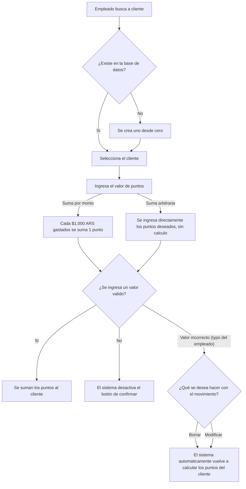

# Diagrama de flujo para sumar puntos

## FAQ

1. ¿Cómo se crean los clientes?
> Desde el Panel Administrativo, en la pantalla `Administrar puntos`, se encuentra el botón "Crear Cliente", se requiere el nombre y número de teléfono del cliente para crearlo. Además, este botón también se encuentra en la pantalla de `Listado de clientes`.

2. ¿Qué pasa si me equivoco y le sumo una cantidad incorrecta de puntos a un cliente?
> En la pantalla de `Administrar puntos`, se puede modificar el movimiento de puntos para corregir el error desde la lista de movimiento de puntos que está la la derecha del formulario para sumar puntos.

3. ¿Qué diferencia hay entre sumar puntos por monto y sumar puntos arbitrariamente?
> La diferencia es que sumar puntos por monto se calcula automáticamente según el valor gastado (cada $1.000 ARS gastados se suma 1 punto), mientras que sumar puntos arbitrariamente permite ingresar una cantidad específica de puntos sin cálculo automático, permitiendo una operación manual.

4. ¿El sistema registra los montos ingresados? ¿Qué pasa si el monto es un valor como $1.999 ARS?
> El sistema NO registra los montos ingresados, solo se registra el valor calculado en base al monto gastado. Si se ingresa un monto como $1.999 ARS, el sistema solo registra el valor calculado en base al monto gastado, en este caso, 1 punto. Bonus bissen no se encarga de cuestiones financieras o de registrar ventas, solo se encarga de la lógica de puntos.
