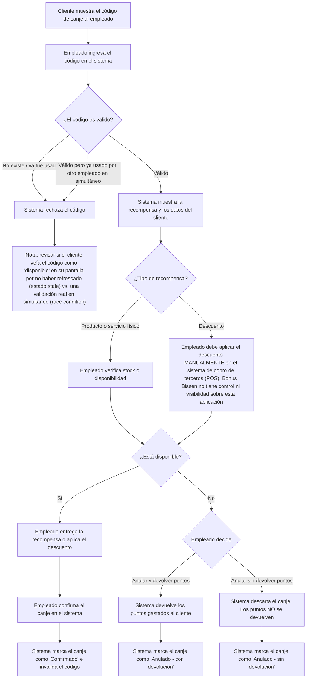

# Diagrama de flujo para validación de canjes

## FAQ

1. ¿Qué pasa si el código de canje ya fue usado o no existe?
> Si se ingresa un código que ya fue usado o no existe el sistema lo rechaza, especificando en cada escenario que fue o usado o que no existe tal código.

2. ¿Cómo se controla un canje de tipo descuento si el negocio usa un sistema de cobro de terceros para facturar?
> Todos los descuentos y recompensas que con negocio pueda ofrecer se aplican de forma manual. Bonus Bissen no interactua de ninguna forma con sistemas de terceros. Los descuentos, por ejemplo, deben aplicarse de forma manual por los empleados a la ahora de cobrar el producto o servicio.

3. ¿Qué diferencia hay entre "anular y devolver puntos" y "anular sin devolver puntos"? ¿Cuándo se usa cada opción?
> En ambos casos un canje queda anulado. Anular y devolver los puntos puede usarse cuando un cliente canjea una recompensa, pero al momento de ir a buscarla ya no está disponible (falta de stock, recompensa ya no es valida, etc.) y sin devolver los puntos se usa en casos donde ...

4. ¿Queda algún registro de quién anuló un canje y por qué?
> Si, se registra quién hace las validaciones (confirma y anular canjes), aunque bonus bissen no cuenta con una opción para especificar "por qués".

5. ¿Qué pasa si un cliente ve una recompensa o un código en su pantalla que ya fue eliminado o usado, porque no actualizó la app?
> El sistema valida internamente que al canjear una recompensa esta esté disponible. En cuyo caso que el cliente canjee algo que ya no está disponible por un estado `stale` del frontend, el servido responderá con un mensaje tipo "Esta recompensa ya no está disponible" y no se le descontaran los puntos.

6. ¿Puede un empleado modificar la cantidad de puntos que se devuelve al anular un canje, o siempre se devuelve el valor exacto que se gastó?
> Siempre se devuelve el valor exacto que se gastó.
